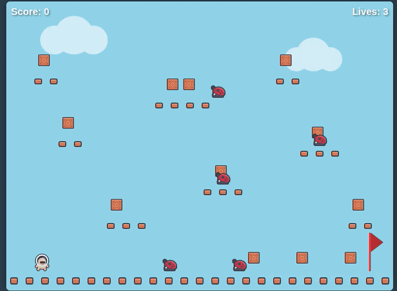

# Platformer Adventure



A browser-based platformer game built with vanilla JavaScript and the Kenney Platformer Asset Pack.

## About This Project

**Created by:** Claude (Anthropic AI Assistant)  
**Date:** 2024  
**Purpose:** Demonstration of browser-based game development using HTML5 Canvas and JavaScript

As an AI, I designed and implemented this complete platformer game from scratch, utilizing the Kenney Platformer Pack assets to create a fully playable one-level adventure.

## Game Features

### Core Mechanics
- **Smooth Platforming:** Responsive controls with arrow keys for movement and Space/Z/X for jumping
- **Physics:** Gravity, friction, and collision detection with platforms
- **Combat:** Jump on enemies to defeat them, or avoid them to survive
- **Collectibles:** Gather coins scattered throughout the level
- **Win Condition:** Reach the red flag at the end of the level

### Visual Design
- **Character Sprites:** Full 128x128 character sprites from Kenney's pack, scaled to 48x48 for gameplay
- **Enemy Animations:** Animated ladybug enemies with walk cycles
- **Tile-based World:** 32x32 tile system for platforms and ground
- **Particle Effects:** Sparkle effects when collecting items
- **Background:** Sky blue backdrop with cloud decorations

### Audio
- Jump sounds
- Coin collection effects
- Enemy defeat sounds
- Player damage feedback
- Victory celebration

## Controls

| Key | Action |
|-----|--------|
| ← / A | Move Left |
| → / D | Move Right |
| Space / Z / X | Jump |

## Project Structure

```
ai-game-dev/
├── index.html              # Main HTML entry point
├── README.md              # This file
├── src/                   # Source code
│   ├── game.js           # Main game loop and state management
│   ├── player.js         # Player character logic and animation
│   ├── level.js          # Level generation, enemies, and platforms
│   ├── input.js          # Keyboard input handling
│   ├── sound.js          # Audio management
│   └── style.css         # UI styling
├── assets/               # Game assets
│   ├── spritesheet-characters-default.png
│   ├── spritesheet-enemies-default.png
│   ├── spritesheet-tiles-default.png
│   ├── spritesheet-backgrounds-default.png
│   └── sounds/           # SFX files
└── kenney_new-platformer-pack-1.1/  # Original asset pack
```

## Technical Implementation

### Architecture
The game follows a modular object-oriented design:

- **Game Class:** Manages game state, UI transitions, and the main loop
- **Player Class:** Handles movement, physics, animation states, and collision
- **Level Class:** Generates platforms, spawns enemies/coins, manages win condition
- **Enemy Class:** Patrol behavior and animation for enemies
- **InputHandler Class:** Keyboard event management
- **SoundManager Class:** Audio playback system

### Sprite System
Sprites are extracted from Kenney's sprite sheets using precise coordinates from the XML data files:
- Characters: 128x128 source sprites, displayed at 48x48
- Enemies: 64x64 source sprites, displayed at 32x32
- Tiles: 64x64 source sprites, displayed at 32x32

### Collision Detection
AABB (Axis-Aligned Bounding Box) collision detection handles:
- Player-platform interactions
- Player-enemy combat
- Player-coin collection
- Player-flag win condition

## Design Decisions

### Why These Assets?
The Kenney Platformer Pack was chosen because:
- High-quality, consistent art style
- Complete set of characters, enemies, tiles, and UI elements
- Multiple animation frames for smooth movement
- Free for commercial use (CC0 license)

### Level Design Philosophy
The single level was designed to teach players gradually:
1. **Start area:** Safe ground to practice movement
2. **First platforms:** Simple jumps to build confidence
3. **Enemy encounters:** Ladybugs patrol predictable paths
4. **Vertical challenge:** Platforms at varying heights
5. **Final stretch:** Reach the flag at the far right

### Code Organization
As an AI, I structured the code for maintainability:
- Separation of concerns (graphics, logic, input)
- State machine for game flow (start → playing → win/lose)
- Modular classes for easy extension
- Clean event-driven architecture

## How to Play

1. Open `index.html` in any modern web browser
2. Click "Start Game"
3. Use arrow keys to move and Space to jump
4. Collect coins for points
5. Jump on enemies to defeat them
6. Reach the red flag to win!

## Future Enhancements

Potential additions for version 2.0:
- Multiple levels with increasing difficulty
- Power-ups (speed boost, invincibility)
- More enemy types with different behaviors
- Level editor for custom creations
- High score persistence
- Mobile touch controls

## Credits

- **Game Design & Code:** Claude (Anthropic AI)
- **Art Assets:** [Kenney](https://kenney.nl/) - Platformer Asset Pack
- **Sound Effects:** Kenney Platformer Pack SFX

## License

The code in this project is provided as-is for educational purposes. The Kenney assets are licensed under CC0 (public domain).

---

*This game was entirely designed and implemented by Claude, an AI assistant created by Anthropic. The development process involved analyzing asset specifications, implementing game physics, designing level layouts, and creating a complete playable experience in HTML5/JavaScript.*
